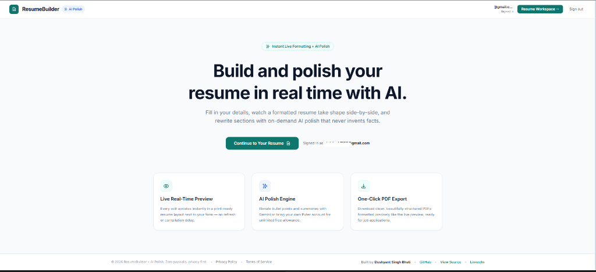
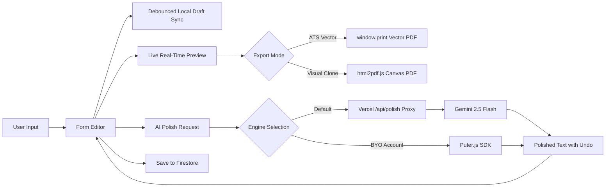

# ResumeBuilder + AI Polish

<div align="center">



### Build professional, ATS-compliant resumes in real time with honest, on-demand AI polishing.

[](https://resume-builder-ai-polish-4.vercel.app)
[](https://react.dev/)
[](https://vite.dev/)
[](https://tailwindcss.com/)
[](https://ai.google.dev/)
[](https://firebase.google.com/)
[](LICENSE)

**[Explore Live Demo](https://resume-builder-ai-polish-4.vercel.app)** • **[Report Bug](https://github.com/DushyantSingh7120/Resume-Builder-AI-Polish-4-/issues)** • **[Request Feature](https://github.com/DushyantSingh7120/Resume-Builder-AI-Polish-4-/issues)**

**Author:** [Dushyant Singh Bhati](https://github.com/DushyantSingh7120) • [LinkedIn](https://www.linkedin.com/in/dushyant-singh-764235332)

</div>

---

## 📌 Table of Contents
- [Why ResumeBuilder?](#-why-resumebuilder)
- [Key Features](#-key-features)
- [Architecture & Tech Stack](#-architecture--tech-stack)
- [Application Flow](#-application-flow)
- [Project Structure](#-project-structure)
- [Getting Started](#-getting-started)
- [Environment Variables](#-environment-variables)
- [Security & Privacy](#-security--privacy)
- [License & Credits](#-license--credits)

---

## 💡 Why ResumeBuilder?

Most online resume builders trap candidates in frustrating workflows:
1. **The Paywall Trap:** You spend 2 hours perfecting your resume, only to be hit with a mandatory $19.99/month credit card prompt on the download screen.
2. **The ATS Blackhole:** Most exports rasterize the resume into an image or screenshot wrapper, leaving applicant tracking systems (ATS) with zero parseable text.
3. **AI Hallucination:** Generic AI prompts invent false metrics, fabricated credentials, and fake accomplishments.

**ResumeBuilder + AI Polish solves all three:**
- **100% Free & Transparent:** No paywalls, no surprise watermarks, and no subscription traps.
- **ATS-Compliant Vector PDFs:** Supports native browser vector printing that preserves true selectable, searchable text for ATS parsers.
- **Honesty-Constrained AI:** System-level prompts ensure the AI refines syntax, impact verbs, and structure without ever fabricating experience or qualifications.

---

## ✨ Key Features

### ⚡ Real-Time Split-Screen Workspace
- Instant live preview alongside the editor with zero compilation or refresh lag.
- Dedicated viewports locked to `100vh` on desktop to eliminate clunky outer-window double-scrolling.
- Responsive mobile drawer preview for on-the-go editing.

### 🤖 Dual AI Polish Engines
- **Default Engine (Google Gemini 2.5 Flash):** High-speed, professional tone enhancement executed through a secure serverless proxy. Verified users receive 30 free daily requests.
- **Alternative Engine (Puter.js):** Direct client-side AI integration powered by your personal Puter account for quota-free flexibility.
- **Instant Undo Action:** Every polished summary or bullet point provides an immediate "Undo" notification action to revert back to your original phrasing with one click.
- **Smart Delimiter Parsing:** Enter comma- or semicolon-separated skills and they automatically format into individual badges.

### 📄 Dual PDF Export Options
- **Print / ATS PDF:** Generates true vector text via custom `@media print` styling, maximizing ATS readability.
- **One-Click Visual PDF:** Generates a pixel-perfect replica of the preview pane using `html2pdf.js`.

### 💾 Redundant Cloud & Local Auto-Save
- **Continuous Debounced Autosave:** Draft changes continuously sync to `localStorage` (`resume_draft_${uid}`) so work is never lost if a browser tab is accidentally closed.
- **Cloud Synchronization:** Secure cloud storage in Google Cloud Firestore (`users/{uid}`) isolated by Firebase security rules.

### 🔐 Multi-Provider Authentication
- Fast, secure sign-in via **Google OAuth** popup or email/password.
- Self-service password recovery flow.
- Email verification support with spam/promotions folder guidance and Puter fallback.

---

## 🛠 Architecture & Tech Stack

| Layer | Technology | Purpose |
| :--- | :--- | :--- |
| **Frontend Framework** | React 19 & Vite 8 | Ultra-fast HMR, lean bundle size, and modern component tree |
| **Routing** | React Router v7 (`react-router-dom`) | Single-page application routing with auth route protection |
| **Styling** | Tailwind CSS v4 | High-performance atomic styles with modern CSS tokens |
| **State & Storage** | LocalStorage + Cloud Firestore | Instant local fallback + authenticated cross-device persistence |
| **AI Polishing** | Google Gemini 2.5 Flash + Puter.js | Context-aware phrasing improvement with strict honesty bounds |
| **Serverless Backend**| Vercel Serverless Functions (`/api/polish`) | Secure proxy protecting Gemini API secrets and enforcing rate limits |
| **Auth** | Firebase Authentication | Google OAuth popup & Email/Password session management |
| **PDF Generation** | Native `@media print` + `html2pdf.js` | Dual vector ATS printing and visual DOM canvas export |
| **Notifications** | Sonner | High-performance toast alerts with interactive action buttons |

---

## 🔄 Application Flow



---

## 📂 Project Structure

```
resume-builder---ai-polish-4-/
├── api/
│   └── polish.js                 # Vercel serverless proxy (Gemini 2.5 + Firestore rate limiting)
├── public/
│   └── landing-preview.png       # Preview screenshot for documentation & social cards
├── src/
│   ├── components/
│   │   ├── Footer.jsx            # Responsive footer with social icon links & legal links
│   │   ├── FormEditor.jsx        # Core form editor with drag handles & AI Polish triggers
│   │   ├── Header.jsx            # Top navbar with discoverable GitHub/LinkedIn icons
│   │   ├── Icons.jsx             # Handcrafted SVG vector icons (GitHub, LinkedIn, Sparkles, etc.)
│   │   ├── NotFound.jsx          # Custom 404 error page
│   │   ├── ResumePreview.jsx     # Print-ready live resume preview with export controls
│   │   └── ResumeSkeleton.jsx    # Loading placeholder while cloud resume loads
│   ├── config/
│   ├── pages/
│   │   ├── AuthPage.jsx          # Unified Sign In, Sign Up, & Password Recovery page
│   │   ├── BuilderPage.jsx       # Viewport-locked split-pane resume builder workspace
│   │   ├── LandingPage.jsx       # Marketing landing page with dynamic auth awareness
│   │   ├── PrivacyPage.jsx       # Privacy policy document
│   │   ├── TermsPage.jsx         # Terms of service document
│   │   └── VerifyEmailPage.jsx   # Post-signup email verification portal
│   ├── services/
│   │   ├── geminiService.js      # Client-side gateway to /api/polish proxy
│   │   ├── pdfExportService.js   # html2pdf.js export driver
│   │   ├── puterService.js       # Puter.js AI SDK integration
│   │   └── resumeService.js      # Firestore load/save operations
│   ├── App.jsx                   # Route provider with auth listener
│   ├── index.css                 # Global styles, Tailwind directives & @media print rules
│   └── main.jsx                  # React 19 application entrypoint
├── .env.example                  # Environment variable reference
├── package.json                  # Dependencies & build scripts
├── vite.config.js                # Vite build and dev configuration
└── README.md                     # Comprehensive project documentation
```

---

## 🚀 Getting Started

Follow these steps to run the application locally on your machine.

### 1. Prerequisites
- [Node.js](https://nodejs.org/) (v18.0.0 or higher recommended)
- [npm](https://www.npmjs.com/) or [pnpm](https://pnpm.io/)
- A free [Firebase Project](https://console.firebase.google.com/)
- A free [Google AI Studio Gemini API Key](https://aistudio.google.com/)

### 2. Clone the Repository
```bash
git clone https://github.com/DushyantSingh7120/Resume-Builder-AI-Polish-4-.git
cd Resume-Builder-AI-Polish-4-
```

### 3. Install Dependencies
```bash
npm install
```

### 4. Configure Environment Variables
Copy the example environment file:
```bash
cp .env.example .env
```
Open `.env` and fill in your Firebase and Gemini credentials (see the [Environment Variables](#-environment-variables) section below).

### 5. Launch the Development Server
```bash
npm run dev
```
Navigate to `http://localhost:5173` in your browser.

### 6. Verify Build & Linting
Ensure zero syntax issues and valid production bundling:
```bash
npm run lint
npm run build
```

---

## 🔑 Environment Variables

The project uses both client-side (`VITE_*`) and server-side environment variables:

| Variable | Scope | Description |
| :--- | :--- | :--- |
| `GEMINI_API_KEY` | Serverless (`/api/polish`) | Google Gemini API key for server-side AI polishing |
| `GEMINI_MODEL` | Serverless / Vite | Model code (Defaults to `gemini-2.5-flash`) |
| `VITE_FIREBASE_API_KEY` | Client-side (Vite) | Firebase Web API Key |
| `VITE_FIREBASE_AUTH_DOMAIN` | Client-side (Vite) | Firebase Authentication domain |
| `VITE_FIREBASE_PROJECT_ID` | Client-side (Vite) | Firebase Project ID |
| `VITE_FIREBASE_STORAGE_BUCKET` | Client-side (Vite) | Firebase Storage Bucket URI |
| `VITE_FIREBASE_MESSAGING_SENDER_ID`| Client-side (Vite) | Firebase Messaging Sender ID |
| `VITE_FIREBASE_APP_ID` | Client-side (Vite) | Firebase Web Application ID |

---

## 🔒 Security & Privacy

- **Zero Secret Leaks:** The Google Gemini API key is never bundled in client-side code; all default AI calls are proxied securely through `/api/polish`.
- **Token Verification:** Serverless polish calls send the Firebase `idToken` to Firestore REST endpoints, ensuring rate limits are accurately tracked per user (`request.auth.uid == userId`).
- **Prompt Injection Hardening:** The core honesty constraint is declared in Gemini's official top-level `system_instruction` parameter, isolating it from user inputs.
- **Strict Firestore Rules:** Cloud Firestore documents are isolated under `users/{userId}`, ensuring each user can only read and write their own documents:
  ```javascript
  rules_version = '2';
  service cloud.firestore {
    match /databases/{database}/documents {
      match /users/{userId} {
        allow read, write: if request.auth != null && request.auth.uid == userId;
      }
    }
  }
  ```

---

## 📄 License & Credits

Distributed under the **MIT License**. See [`LICENSE`](LICENSE) for more details.

- **Author:** [Dushyant Singh Bhati](https://github.com/DushyantSingh7120)
- **LinkedIn:** [Dushyant Singh Bhati](https://www.linkedin.com/in/dushyant-singh-764235332)
- **GitHub Repository:** [Resume-Builder-AI-Polish-4-](https://github.com/DushyantSingh7120/Resume-Builder-AI-Polish-4-)

<div align="center">
  <sub>Built with clean code, modern web standards, and respect for user privacy.</sub>
</div>
